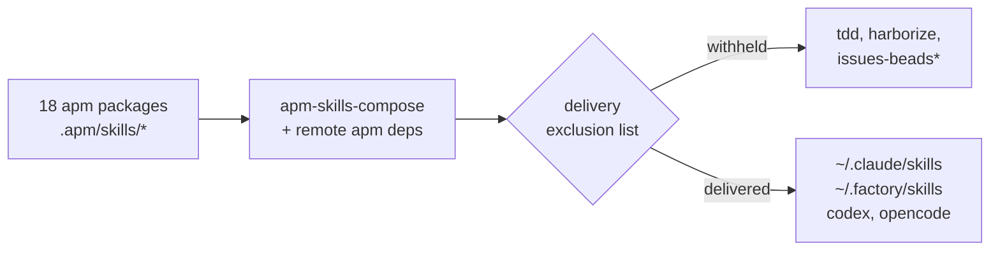

## First-party agent skill corpus

135 skills across 18 apm packages, published as a marketplace any project can install independently of the Nix configurations.
Each group directory carries an `apm.yml` and a `plugin.json`; the marketplace manifest is `../../../../.github/plugin/marketplace.json`.

A group's skills are discovered by reading its `.apm/skills/` directory, so neither manifest enumerates them.
Adding a skill means creating `<group>/.apm/skills/<name>/SKILL.md`; there is no registration step.

## Two things that will silently discard your edits

**Twelve skills are CLI-generated.** Every skill carrying `generatedBy` frontmatter is regenerated by `../../../apps/openspec-refresh-vendored-artifacts.sh` from a sandboxed `openspec init`, which replaces the directory wholesale. Edits to them survive until the next refresh and then vanish without a diff to explain it. All twelve live in `planning-and-development/`, whose four hand-authored siblings — `agentic-planning-development-workflow`, `linear-project-management`, `openspec-bdd-bridge`, `openspec-linear-sync` — are ours to edit. Check the frontmatter before editing anything in that group.

**A source skill is invisible to the build until git tracks it.** Flake sources are git-tracked files only, so a new skill directory is absent from the composed output rather than an error. The symptom is a successful build that silently lacks the skill.

## Delivery pipeline

Composition and delivery are two stages with a filter between them, which is why the composed count and the delivered count differ:

`pkgs/by-name/apm-skills-compose/` flattens the packages plus remote apm dependencies such as superpowers into one tree; `../skills/default.nix` then re-globs that tree, applies an exclusion list, and delivers the result. A skill present in the composed output but absent from `~/.claude/skills/` is withheld deliberately, not broken — the exclusions and their reasons are in that file.

## Authoring

`SKILL.md` frontmatter needs a `name` matching `[a-z0-9-]` and a `description` at most 1024 characters.
The description is the entire trigger surface: a skill fires on what its description says, so content added without extending the description is unreachable in practice.

Skills follow a strict one-owner discipline. Each concept has exactly one owning skill, and siblings point at the owner rather than restating it, so an addition that duplicates an existing skill's material is a routing edit rather than new prose.
Prose conventions are in `preferences-code-and-collaboration-conventions/.apm/skills/preferences-prose-clarity/`.

Groups are named for their subject: `preferences-*` packages hold conceptual foundations loaded on topic, and the remaining groups hold operational workflows.
