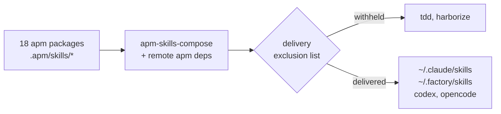

## First-party agent skill corpus

126 skills across 18 apm packages, published as a marketplace any project can install independently of the Nix configurations.
These counts are computed rather than maintained here: `testing-and-quality/.apm/skills/harborize/scripts/census.py --root modules/home/ai/plugins` regenerates `census.json`, whose `provenance` block carries the authoritative totals and the revision they were taken at.
Each group directory carries an `apm.yml` and a `plugin.json`; the marketplace manifest is `../../../../.github/plugin/marketplace.json`.

Each `plugin.json` declares `"skills": ["./.apm/skills"]`, and apm enumerates that container's immediate children as the deployable set.
Adding a skill still means creating `<group>/.apm/skills/<name>/SKILL.md`; there is no registration step, since the container declaration covers every child without naming it.
apm 0.29.0 requires a plugin-classified package to declare its skill sources, so an undeclared `.apm/skills/` directory deploys nothing.

## Two things that will silently discard your edits

**Twelve skills are CLI-generated.** Every skill carrying `generatedBy` frontmatter is regenerated by `../../../apps/openspec-refresh-vendored-artifacts.sh` from a sandboxed `openspec init`, which replaces the directory wholesale. Edits to them survive until the next refresh and then vanish without a diff to explain it. All twelve live in `planning-and-development/`, whose four hand-authored siblings — `agentic-planning-development-workflow`, `linear-project-management`, `openspec-bdd-bridge`, `openspec-linear-sync` — are ours to edit. Check the frontmatter before editing anything in that group.

**A source skill is invisible to the build until git tracks it.** Flake sources are git-tracked files only, so a new skill directory is absent from the composed output rather than an error. The symptom is a successful build that silently lacks the skill.

## Delivery pipeline

Composition and delivery are two stages with a filter between them, which is why the composed count and the delivered count differ:

`pkgs/by-name/apm-skills-compose/` flattens the packages plus remote apm dependencies such as superpowers into one tree; `../skills/default.nix` then re-globs that tree, applies an exclusion list, and delivers the result. A skill present in the composed output but absent from `~/.claude/skills/` is withheld deliberately, not broken — the exclusions and their reasons are in that file.

## Authoring

`SKILL.md` frontmatter needs a `name` matching `[a-z0-9-]` and a `description` at most 1024 characters.
The description is the entire trigger surface: a skill fires on what its description says, so content added without extending the description is unreachable in practice.

Skills follow a strict one-owner discipline. Each concept has exactly one owning skill, and siblings point at the owner rather than restating it, so an addition that duplicates an existing skill's material is a routing edit rather than new prose.
Prose conventions are in `preferences-code-and-collaboration-conventions/.apm/skills/preferences-prose-clarity/`.

Within `version-control-and-forge`, `mergify-stack` is an unedited upstream mechanism skill from `Mergifyio/mergify-cli`.
`git-stacked-pr-integration` remains the first-party owner of policy, roles, VCS routing, and evidence.

Groups are named for their subject: `preferences-*` packages hold conceptual foundations loaded on topic, and the remaining groups hold operational workflows.

## Corpus orientation

`../../tools/agents-md.nix` used to carry a hand-maintained, alphabetically-flat index of proactively-read skills, roughly 76 bullets long.
All nine consumer harnesses already inject their own name-and-description catalog of this same skill tree at load time, so that index duplicated a catalog everywhere it was force-loaded.
Its one piece of non-duplicated value was the topical grouping the flat list implied by its ordering, the hand-written glosses, and the two `@` force-load inlines it carried.
The topical grouping is preserved below as a maintained orientation layer; the index itself is preserved verbatim as a dated, frozen archive further down.

### Topical clusters across packages

No directory listing or harness catalog reveals these clusters, because the skills that belong together conceptually are scattered across different apm packages by design — each package groups by publication concern (conceptual foundation vs. operational workflow), not by topic.
The clusters below are drawn directly from the removed index's existing bullet ordering; grouping boundaries were not invented, only named and mapped to the packages the member skills live in.

- **Conventions and version-control hygiene** — `preferences-style-and-conventions`, `preferences-git-version-control`, `preferences-prose-clarity`, `preferences-essential-complexity`, `preferences-git-history-cleanup`, `preferences-comment-cleanup` (all `preferences-code-and-collaboration-conventions`); `jj-summary`, `jj-workflow`, `jj-history-cleanup` (`version-control-and-forge`).
- **Documentation, planning governance, and session/agent orchestration** — `preferences-documentation`, `preferences-change-management` (`preferences-code-and-collaboration-conventions`); `agentic-planning-development-workflow`, `linear-project-management` (`planning-and-development`); `meta-session-resume`, `meta-search-sessions`, `meta-orchestrator-initiate`, `meta-orchestrator-checkpoint` (`agent-orchestration-and-meta-tooling`); `knowledge-graph` (`document-authoring-and-visualization`); `using-superpowers` (remote apm dependency, not one of the 18 first-party packages).
- **Domain modeling and event-driven architecture** — `preferences-architectural-patterns`, `preferences-architecture-diagramming`, `preferences-domain-modeling`, `preferences-discovery-process`, `preferences-collaborative-modeling`, `preferences-strategic-domain-analysis`, `preferences-bounded-context-design` (`preferences-domain-driven-architecture`); `preferences-event-sourcing`, `preferences-event-catalog-tooling`, `preferences-event-catalog-qlerify`, `preferences-event-modeling` (`preferences-event-driven-systems`).
- **Theoretical foundations and formal refinement** — `preferences-functional-reactive-programming`, `preferences-algebraic-data-types`, `preferences-theoretical-foundations`, `preferences-computational-system-taxonomy`, `preferences-algebraic-laws` (`preferences-functional-programming-theory`); `refinement-driven-development`, `preferences-requirements-engineering`, `satisfaction-argument-audit`, `nucleus-platform` (`formal-specification-and-refinement`).
- **Adaptive planning, verification, and reliability engineering** — `preferences-adaptive-planning`, `preferences-validation-assurance`, `preferences-compositional-continuous-verification`, `preferences-observability-engineering`, `preferences-production-readiness`, `preferences-distributed-systems` (`preferences-operations-and-reliability`); `preferences-workflow-orchestration-algebra`, `preferences-scalable-probabilistic-modeling-workflow`, `preferences-scientific-inquiry-methodology` (`preferences-data-and-scientific-computing`); `atdd-outer-loop` (`testing-and-quality`); `test-driven-development`, `systematic-debugging`, `verification-before-completion`, `code-review` (remote apm dependency).
- **Data, schema, and deployment-adjacent engineering** — `preferences-railway-oriented-programming` (`preferences-functional-programming-theory`); `preferences-data-modeling`, `preferences-json-querying` (`preferences-data-and-scientific-computing`); `preferences-schema-versioning` (`preferences-event-driven-systems`); `preferences-web-application-deployment`, `preferences-cloudflare-wrangler-reference` (`preferences-web-platform-and-deployment`); `preferences-secrets` (`preferences-nix-and-secrets`).
- **Nix engineering** — `preferences-nix-development`, `preferences-nix-checks-architecture`, `preferences-nix-ci-cd-integration` (`preferences-nix-and-secrets`); `nix-flake-pr-cycle`, `ci-log-verification` (`nix-build-operations`).
- **Language-specific and web/visualization development** — `preferences-python-development`, `preferences-rust-development`, `preferences-haskell-development`, `preferences-typescript-nodejs-development` (`preferences-programming-languages`); `preferences-react-tanstack-ui-development`, `preferences-web-platform-foundations`, `preferences-hypermedia-development`, `preferences-hypermedia-documents` (`preferences-web-platform-and-deployment`); `scientific-visualization`, `text-to-visual-iteration` (`document-authoring-and-visualization`).

### Suppression and withholding mechanisms

Three separate, independently-operated mechanisms currently suppress or withhold a skill, and nothing before this section collected them in one place.

1. **`disable-model-invocation: true` frontmatter**, set per skill, prevents that skill from auto-triggering on a description match; the skill is still delivered and still invocable by explicit name or slash command. 21 of the 126 skills in this corpus carry the flag set to `true`, and 2 carry it explicitly set to `false`. Factually, all 21 are operational or command-style skills — meta-tooling commands, event-modeling workflow steps, document-conversion utilities, and git/jj/nix operational commands — and none of them are `preferences-*` conceptual-foundation skills; no `preferences-*` skill in this corpus carries the flag.
2. **The delivery exclusion list** (`excludedSkills` in `../skills/default.nix`) removes a skill from every delivered harness target (`~/.claude/skills`, `~/.factory/skills`, codex, opencode) even though the skill still exists in the composed tree. It currently withholds `tdd` and `harborize`, each for a documented reason in that file.
3. **A named reference with an explicit loading condition**, in `../../tools/agents-md.nix` (this file's sibling), states a skill's name in the generated context text alongside a stated condition for when to load it, rather than inlining the skill's full body via a path-based force-load prefix and bypassing both delivery and description-based discovery. Only one skill carries this treatment; see "Archived skill index" below for the one that used to carry the old `@` force-load prefix instead.

The `issues-beads-*` family (`issues-beads`, `issues-beads-audit`, `issues-beads-checkpoint`, `issues-beads-evolve`, `issues-beads-init`, `issues-beads-orient`, `issues-beads-prime`, `issues-beads-seed`) previously sat behind mechanisms 1 and 2 above; both are now moot for that family because the eight directories were deleted outright on 2026-08-26, since beads no longer owns the work — Linear and OpenSpec now do. Recover any of them from history, once this deletion is committed, with `git log --diff-filter=D -- modules/home/ai/plugins/beads-issue-tracking-and-session-workflow/.apm/skills/`, which finds the deleting commit by path prefix rather than by a hash that does not exist yet.

### Archived skill index

Frozen snapshot of the proactive-read skill index, taken 2026-08-26, removed from <code>../../tools/agents-md.nix</code>

This list is not maintained.
It is a byte-for-byte copy of the descriptive glosses that were force-loaded or proactively read from `agents-md.nix` at the moment they were deleted from that file, kept only so a reader can see what a session used to be told to read.
Do not treat any gloss below as current: a skill's own `description` frontmatter in its `SKILL.md` is the authoritative, currently-maintained source, and drift between these glosses and that frontmatter has already been observed at least once.
Each entry's reference below is normalized to a bare skill name rather than reproducing the generator's original `skillsPath` interpolation (a machine-local `~/.claude/skills` prefix, with an `@` prefix on the two entries that force-loaded), since this README publishes into the marketplace and must not carry machine-local paths.

- style and conventions: `preferences-style-and-conventions`
- git version control: `preferences-git-version-control`
- prose clarity (sentence-level writing discipline, reader processing cost, calibrated claims, editing others' text): `preferences-prose-clarity`
- essential complexity (complexity pays rent in domain invariants; refinement-chain care scaling; falsifiable rigor, sorry-debt): `preferences-essential-complexity`
- git history cleanup: `preferences-git-history-cleanup`
- comment cleanup (uncomment-driven noise-comment removal, load-bearing marker preservation; operational arm of the code-comments policy): `preferences-comment-cleanup`
- jj version control: `jj-summary`
- jj workflow (full): `jj-workflow`
- jj history cleanup (atomic reorder/squash/split, conventional-commit narrative; jj analog of git history cleanup; see also jj-git-interactive-rebase-to-jj): `jj-history-cleanup`
- documentation (three tiers — user-facing Diataxis, development AMDiRE, and the local README hierarchy with its index/leaf roles and earns-its-place bar; prose defers to prose-clarity, diagrams to architecture-diagramming): `preferences-documentation`
- change management: `preferences-change-management`
- agentic planning and development (state-machine router across the Linear-canonical board Backlog -> Todo -> In Progress -> In Review -> Done; AFK/HIL/Manual execution-mode fork; four file-anchored OpenSpec-artifact forward gates): `agentic-planning-development-workflow`
- linear project management (Linear Method ontology, workspace safety gate, ownership-by-layer: Linear + OpenSpec own the work): `linear-project-management`
- superpowers discipline gate (invoke the relevant skill before any response or action, including clarifying questions; process-skills-first): `using-superpowers`
- session resumption (resume command, atuin history, session continuation): `meta-session-resume`
- session search (session transcript discovery, keyword intersection): `meta-search-sessions`
- knowledge graph grounding (cognee reference-corpus indexing/retrieval for grounding technical writing and review; a reference-knowledge index, not agent session memory): `knowledge-graph`
- team orchestration initiate (master-orchestrator mission start; team-level analog of orientation; actor-critic / worker-orchestrator decomposition): `meta-orchestrator-initiate`
- team orchestration checkpoint (master-level cross-cycle state capture and handoff): `meta-orchestrator-checkpoint`
- architectural patterns: `preferences-architectural-patterns`
- architecture diagramming (C4, format selection, diagram compendium): `preferences-architecture-diagramming`
- functional domain modeling (DDD, types, aggregates): `preferences-domain-modeling`
- event sourcing (event replay, state reconstruction, CQRS): `preferences-event-sourcing`
- event catalog tooling (EventCatalog, schema documentation): `preferences-event-catalog-tooling`
- qlerify to eventcatalog (transformation workflow): `preferences-event-catalog-qlerify`
- event modeling (Event Modeling, Qlerify, D2 diagrams): `preferences-event-modeling`
- discovery process: `preferences-discovery-process`
- collaborative modeling (EventStorming, Domain Storytelling): `preferences-collaborative-modeling`
- strategic domain analysis (Core/Supporting/Generic classification): `preferences-strategic-domain-analysis`
- bounded context design (context mapping, integration, ACL): `preferences-bounded-context-design`
- functional reactive programming (FRP foundations, arrows, presheaves): `preferences-functional-reactive-programming`
- algebraic data types (sum/product types, discriminated unions, pattern matching, making illegal states unrepresentable): `preferences-algebraic-data-types`
- theoretical foundations (category/type-theory keystone; capability interfaces over transformer stacks, graded effects/coeffects, Lean-spec-beside-implementation; pairs with refinement-driven-development): `preferences-theoretical-foundations`
- computational system taxonomy (closed vs open systems from automata theory and process calculi; batch/stream/services terminology mapping; heterogeneous composition patterns): `preferences-computational-system-taxonomy`
- algebraic laws (functor/monad laws, property-based testing): `preferences-algebraic-laws`
- refinement-driven development (dependently-typed Lean 4 spec, refine/lower to a Charon/Aeneas-safe Rust subset, lift via Aeneas.Charon, check by translation validation; mechanical proof the ideal not a requirement): `refinement-driven-development`
- requirements engineering (WRSPM pentad; the two obligations W∧S⇒R, the satisfaction argument, and P⇒S; the four dark corners; the designation table; indicative/optative separation; KAOS goal-obstacle analysis; Parnas four-variable model; the WRSPM-versus-AMDiRE shear): `preferences-requirements-engineering`
- satisfaction argument audit (three-gate chain across proof institutions; blind informalization for specification-versus-intent; the trust-surface inventory; the claims status table with satisfiability, non-vacuity, co-vacuity; safe external wording; the never-claim-end-to-end prohibition): `satisfaction-argument-audit`
- nucleus platform (thin router for the spec-anchored approximately-verifiable data-modeling monorepo; Lean 4 structural source of truth; instantiate-then-reconstruct round trip driving structural drift toward zero): `nucleus-platform`
- adaptive planning (control theory, buffer sizing, planning horizons, VSM mapping): `preferences-adaptive-planning`
- workflow orchestration algebra (Dagster/Flyte read through Build Systems à la Carte; free-term vs store-interpreter split, lawful IO managers; data-pipeline orchestration, not agent DAGs): `preferences-workflow-orchestration-algebra`
- validation assurance (severity, evidence quality, confidence, test adequacy, regression, refinement): `preferences-validation-assurance`
- compositional continuous verification (CCV — operating-envelope-plus-regulator pairs composing into a closure operator; theoretical anchor for system-level approximate correctness): `preferences-compositional-continuous-verification`
- acceptance-test-driven development (ATDD outer loop wrapping inner TDD; routes each proposition to BDD / property / law / proof / smoke): `atdd-outer-loop`
- test-driven development (red-green-refactor; no production code without a failing test first): `test-driven-development`
- systematic debugging (root-cause-before-fix discipline; question the architecture after repeated failed fixes; see also diagnosing-bugs): `systematic-debugging`
- verification before completion (evidence before claims; run the verification command before asserting done/passing/fixed/committing): `verification-before-completion`
- code review (two-axis Standards + Spec review of the diff; requesting-code-review author side, receiving-code-review responder side): `code-review`
- observability engineering (structured events, traces, SLOs, instrumentation, telemetry architecture): `preferences-observability-engineering`
- production readiness (ODD, progressive delivery, health checks, incident learning, CI/CD observability): `preferences-production-readiness`
- distributed systems (CAP/PACELC/linearizability, consistency models, CRDTs, idempotency, sagas, dual-write avoidance, deterministic replay): `preferences-distributed-systems`
- scalable probabilistic modeling (Bayesian workflow, simulation-based inference, stochastic dynamical systems): `preferences-scalable-probabilistic-modeling-workflow`
- scientific inquiry methodology (Peircean pragmatism, effective theories, Mayo severity, iterative model building; hierarchy of mechanistic evidence): `preferences-scientific-inquiry-methodology`
- smart constructors and validation patterns: see `preferences-domain-modeling`
- error handling and workflow composition (Result types, railway-oriented): `preferences-railway-oriented-programming`
- data modeling (database schemas, normalization, ER diagrams): `preferences-data-modeling`
- json querying (duckdb, jaq): `preferences-json-querying`
- schema versioning: `preferences-schema-versioning`
- web application deployment: `preferences-web-application-deployment`
- cloudflare wrangler configuration: `preferences-cloudflare-wrangler-reference`
- secrets management: `preferences-secrets`
- nix development (flakes, derivations, modules, code style; new files need tracking before a flake build can see them, since flake sources are git-tracked only; verify with targeted `nix eval`/`nix build` probes and `just check-fast` rather than a bare `nix flake check` sweep — see nix flake PR cycle): `preferences-nix-development`
- nix flake checks architecture (check taxonomy, derivation patterns, VM tests): `preferences-nix-checks-architecture`
- nix CI/CD integration (nix-fast-build, buildbot-nix, effects, migration): `preferences-nix-ci-cd-integration`
- nix flake PR cycle (enumerate checks, probe via nix eval/build, just check-fast, draft PR, buildbot monitor, ready, Mergify): `nix-flake-pr-cycle`
- CI workflow log verification (GHA + buildbot unified retrieval, full log archives, buildbot-logs): `ci-log-verification`
- python development: `preferences-python-development`
- rust development: `preferences-rust-development`
- haskell development: `preferences-haskell-development`
- typescript/node.js development: `preferences-typescript-nodejs-development`
- react/ui development: `preferences-react-tanstack-ui-development`
- web platform foundations (15 properties, capability ladder, paradigm routing): `preferences-web-platform-foundations`
- hypermedia/server-driven UI development: `preferences-hypermedia-development`
- hypermedia document authoring (presentations, SVG, MathML, standalone experiments): `preferences-hypermedia-documents`
- scientific data visualization (figures, tables, diagrams, colormaps): `scientific-visualization`
- text-to-visual iteration (compile-inspect-refine loop, SVG/PNG/PDF pipelines): `text-to-visual-iteration`

